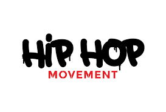

# Applied Data Science @ Columbia
## Fall 2019
## Project 1: A "data story" on the songs of our times




### [Project Description](doc/)
This is the first and only *individual* (as opposed to *team*) this semester. 

Term: Fall 2019

+ Projec title: Hip-hop, a special genre
+ This project is conducted by Xiwen Chen 

+ Project summary: In this R notebook, I try to find the features of the hip-hop song lyrics through Q&A. I do the data processing and saved the tidy object in a R file. For the rock and pop songs account for over 60 percent of the total, I mainly study rock and pop songs inaddition to hip-hop songs. In conclusion, hip-hop lyrics like to use many spoken words, which are not commonly used in rock and pop songs. Hip-hop songs usually express negative emotions and words in hip-hop songs are rich.

+ Questions answered in this project: 
1. What are the most frequently used words in hip-pop lyrics? What about rock and pop?
2. What are the emotions of hip-pop songs? 
3. Are there many duplicate words in hip-hop songs?

Following [suggestions](http://nicercode.github.io/blog/2013-04-05-projects/) by [RICH FITZJOHN](http://nicercode.github.io/about/#Team) (@richfitz). This folder is orgarnized as follows.

```
proj/
├── lib/
├── data/
├── doc/
├── figs/
└── output/
```

Please see each subfolder for a README file.
